# ZenCart eCommerce Website

## Overview
ZenCart is a full-featured eCommerce website built using the MERN stack with enhanced performance optimizations and scalability features. It supports real-time inventory management, authentication, payment processing, and order tracking.

## Live Demo & Repository
- **Live URL**: [ZenCart](https://zencart-estore.onrender.com/)
- **GitHub Repository**: [ZenCart on GitHub](https://github.com/anandhunv/ZenCart/tree/main)

## Tech Stack
### Frontend:
- **React 19**
- **Tailwind CSS 4**
- **Framer Motion** (for animations)
- **Zustand** (state management)
- **Swiper** (carousel)
- **React Router DOM** (navigation)
- **Lucide React** (icons)
- **Recharts** (data visualization)
- **React Confetti** (celebration effects)
- **React Hot Toast** (notifications)
- **Axios** (HTTP requests)

### Backend:
- **Node.js with Express.js**
- **MongoDB** (database)
- **Redis** (caching, session management, and access token storage)
- **Stripe** (payment processing)
- **Authentication** using access tokens stored in Redis
- **CRUD operations** for product management
- **Delivery status tracking**

### Dev Tools & Dependencies:
- **Vite** (fast development environment)
- **ESLint** (code linting)
- **@vitejs/plugin-react** (React support for Vite)

## Features
- ✅ **User Authentication**: Login and register using JWT access tokens stored in Redis.
- ✅ **Product Management**: CRUD operations to add, update, delete, and list products.
- ✅ **Payment Integration**: Stripe for secure payment processing.
- ✅ **Real-Time Features**: Redis caching for improved performance.
- ✅ **Order Tracking**: Users can check their delivery status in real-time.

## Screenshots
### Logo


### Frontend Look
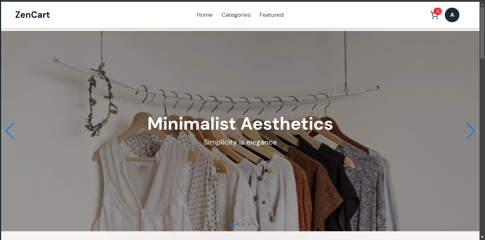
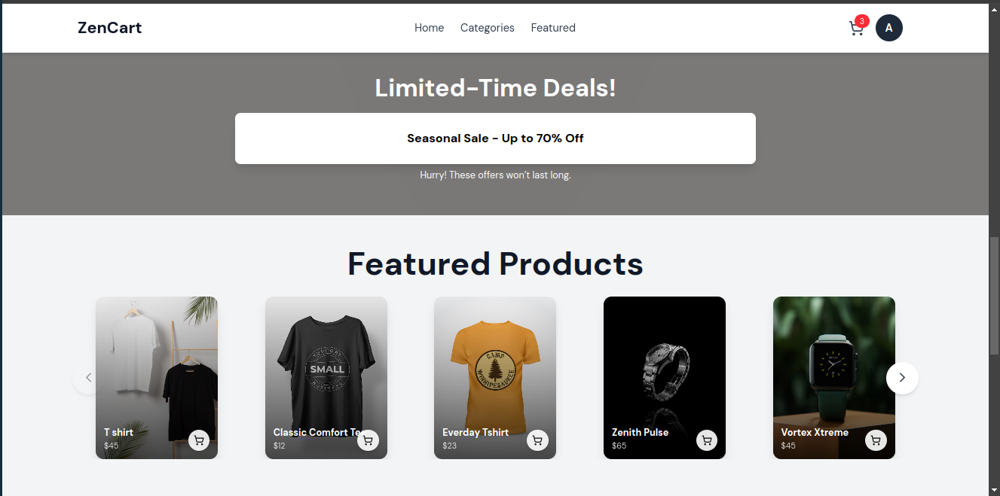
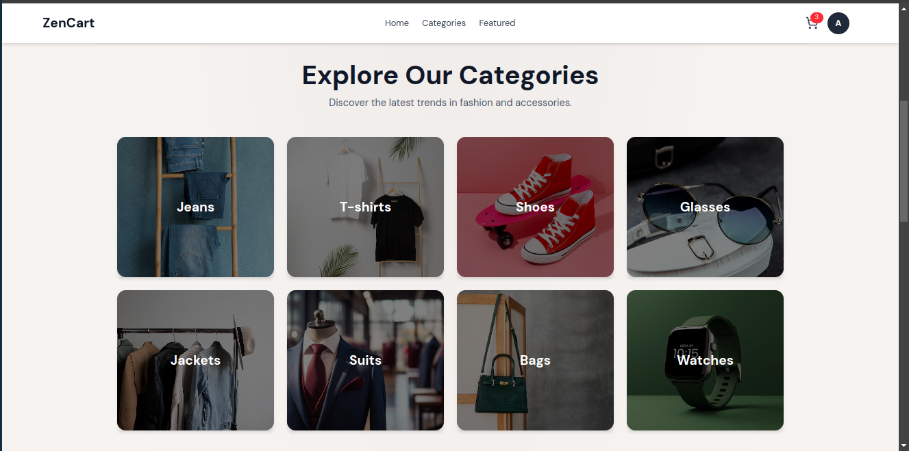

### Item Details & Pages
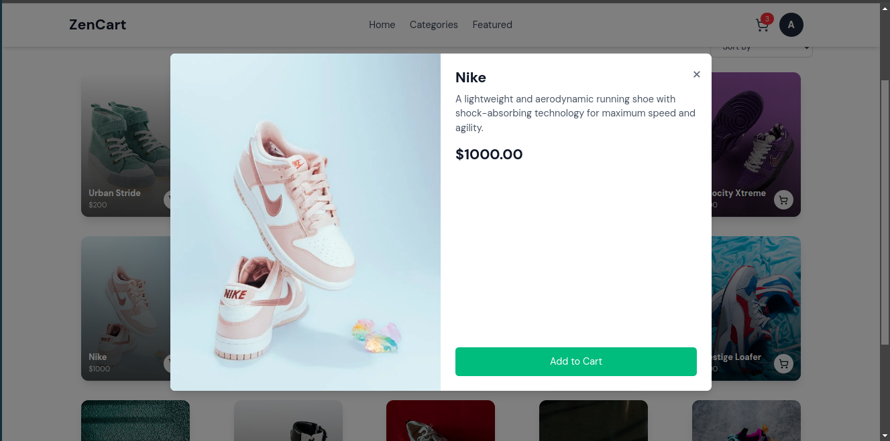
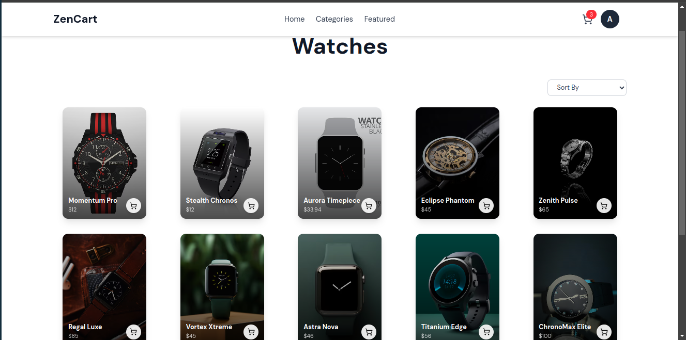
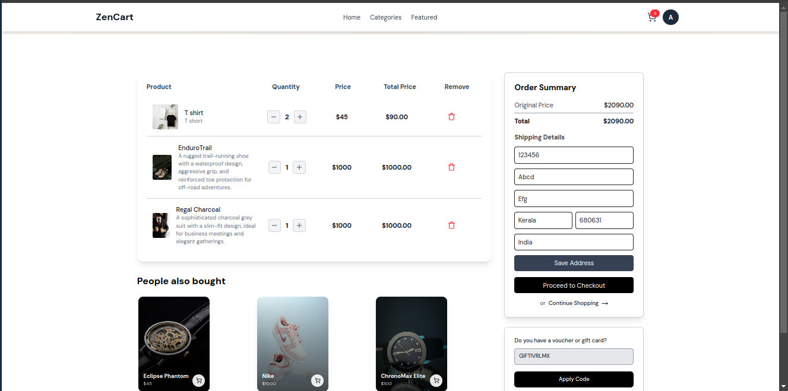

### Admin Dashboard
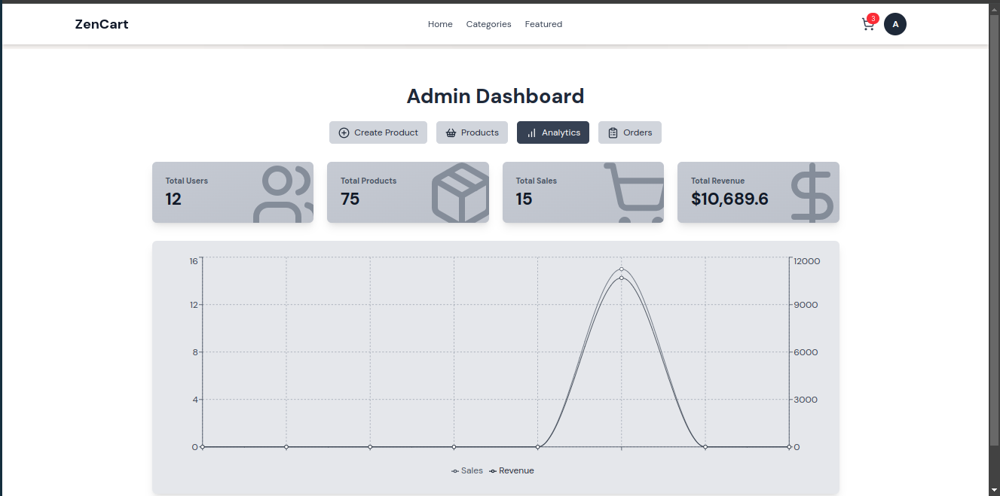
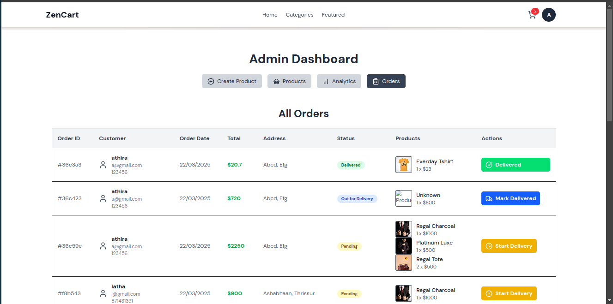
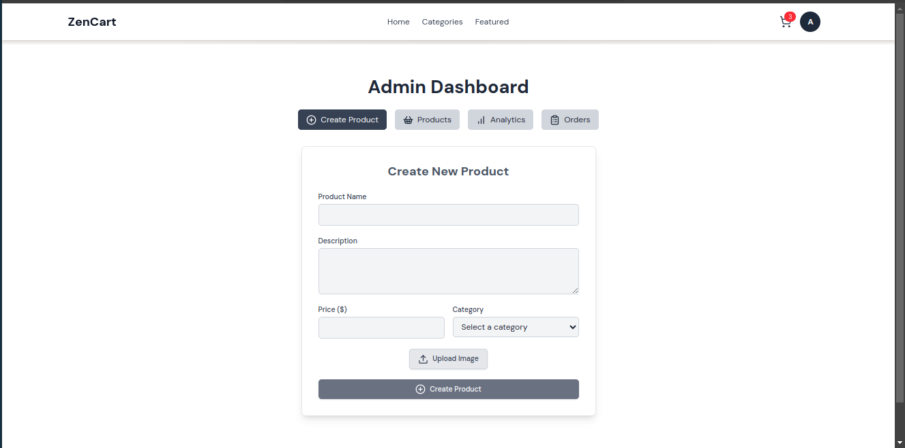
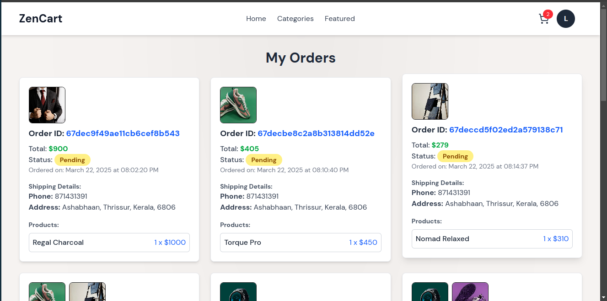
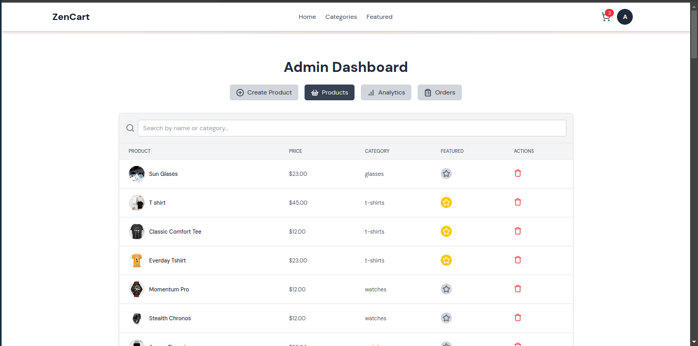

## Installation & Setup
```sh
# Clone the repository
git clone https://github.com/anandhunv/ZenCart.git
cd ZenCart

# Install dependencies
npm install
```

### Environment Variables
Create a `.env` file in the root directory and add the following:
```env
MONGO_URI=your_mongodb_connection_string
REDIS_URL=your_redis_connection_string
STRIPE_SECRET_KEY=your_stripe_secret_key
JWT_SECRET=your_jwt_secret_key
```

### Run Development Server
```sh
npm run dev
```

## Deployment
- The project is deployed using Render for hosting the backend and frontend.
- Ensure environment variables are correctly set for production.

## Contributing
Feel free to fork the repository, submit issues, or create pull requests.

## License
This project is licensed under the **MIT License**.

---
Developed by [Anandhunv](https://github.com/anandhunv/)
